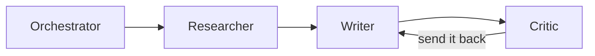
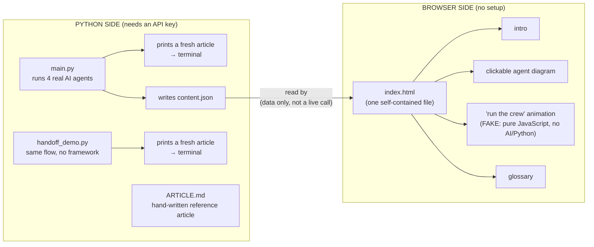

# Multi-agent systems: a runnable demo, an article, and an interactive explainer

This project teaches one idea three ways: a team of AI agents (an orchestrator
delegating to a researcher, a writer, and a critic) beats a single do-everything
agent, because the critic can send weak work back for another round.

It contains three parts that tell the same story:

| Part | File | For whom |
| ---- | ---- | -------- |
| Runnable demo | `main.py`, `handoff_demo.py` | developers who want to run real agents |
| Research article | `ARTICLE.md` | anyone wanting the concepts and the 2026 landscape |
| Interactive explainer | `index.html` | non-technical coworkers, zero setup |

All three describe the **same architecture**:



## How it works (plain-language explanation)

> New here? For a longer, friendlier walkthrough with extra diagrams, see
> **[docs/HOW-IT-WORKS.md](docs/HOW-IT-WORKS.md)**.

**What is an "agent"?** One AI model (here, Google's Gemini) given a single,
specific job. Instead of one AI doing everything at once, you create several, each
with one narrow role, and pass the work down a line like a small newsroom:

- **Orchestrator** — the manager; decides the order and passes each result on. It
  is not a separate AI, it is the framework running the line.
- **Researcher** — gathers the facts.
- **Writer** — turns facts into an article.
- **Critic** — checks the article and can **send it back** to be redone. This
  feedback loop is what makes a team of agents better than one lone agent.

**The two Python files (and why there are two):**

- **`main.py`** is the real thing. It uses a framework called **CrewAI** to run
  four agents (Researcher, Writer, Critic, plus a Curriculum Designer). Give it a
  topic and it prints a freshly written article *and* writes the web page's
  content to `content.json`. CrewAI hides the plumbing so you just describe the
  agents and tasks.
- **`handoff_demo.py`** does the *same* Researcher -> Writer -> Critic flow but
  **without any framework** — plain Python calling Gemini directly. It exists to
  prove there is no magic: an "agent" is just a prompt, and a "handoff" is just
  one function's output becoming the next function's input. `main.py` is an
  automatic car; `handoff_demo.py` is the manual version so you can see the gears.

**`ARTICLE.md`** is a separate, hand-written reference article (kept as-is). The
articles the Python files print are generated fresh by the AI each run and will
vary; `ARTICLE.md` is the reliable one to hand out.

**Does the web page call the Python code? No.** `index.html` never runs Python and
never calls any AI. That is on purpose, so anyone can double-click one file
and learn with no setup, no API key, and no cost. Its "run the crew" button is a
**scripted animation** (JavaScript timers revealing pre-written steps, including
one Critic rejection) — it shows the *flow* without the real engine. The only
link between Python and the page is the **`content.json`** data file the crew
writes; when the page is served over http it loads that file, and when
double-clicked it uses an identical built-in copy as a fallback.



> Double-clicking `index.html` directly (no local server) works too — the page
> falls back to a built-in copy of the same text.

## The free-stack rationale

Everything here runs for **free**.

- The Python demo uses **Google Gemini's free tier** (model
  `gemini-2.5-flash`). A free key requires no credit card.
- The interactive page (`index.html`) is a **single self-contained file** with a
  scripted, simulated crew. It makes **no API calls** and needs **no key**, so
  coworkers can just open it.

A common point of confusion: **a Claude Pro (or ChatGPT Plus) subscription does
NOT include API access.** Those plans cover the chat apps only; calling a model
from code is billed separately. Gemini's free tier is the simplest way to run
real agents at no cost, which is why this project standardizes on it. There are
no paid APIs and no OpenAI dependency anywhere in this repo.

## Get a free Gemini key

1. Go to <https://aistudio.google.com/apikey>.
2. Sign in with a Google account and click **Create API key** (free, no card).
3. Copy `.env.example` to `.env` and paste the key in:
   ```bash
   cp .env.example .env
   # then edit .env so it reads: GEMINI_API_KEY=your-key-here
   ```
   Both scripts load `.env` automatically on startup (via `python-dotenv`), so
   you only do this once - no `export` needed in every new terminal. `.env` is
   gitignored, so your key is never committed.

The free tier has generous but real rate limits. The demos are written to stay
well inside them (the critic loop is capped at one revision).

## Run the demos

Set up a virtual environment and install the dependencies (use Python
3.10-3.13; CrewAI 1.x does not yet support 3.14). If you don't already have
Python 3.12, install it first:

- **macOS** (via [Homebrew](https://brew.sh)):
  ```bash
  brew install python@3.12
  ```
- **Ubuntu**: the system `python3` is often older than 3.12 and the `venv`
  module ships as a separate package, so install both:
  ```bash
  sudo apt update
  sudo apt install -y python3.12 python3.12-venv
  ```
  (If `python3.12` isn't available for your Ubuntu release, add the
  deadsnakes PPA first: `sudo add-apt-repository ppa:deadsnakes/ppa && sudo apt update`.)
- **Windows**: install from [python.org/downloads](https://www.python.org/downloads/)
  or `winget install Python.Python.3.12`.

Then create the virtual environment and install dependencies:

```bash
python3.12 -m venv .venv
source .venv/bin/activate          # Windows: .venv\Scripts\activate
pip install -r requirements.txt
```

(Make sure you've created `.env` as described above before running the demos.)

The demos default to `gemini-2.5-flash`, which has working free-tier quota as
of this writing. If Google's free-tier lineup changes and you hit a 429 with
`limit: 0`, point the demo at a different model by adding a line to `.env`:

```bash
GEMINI_MODEL=gemini-2.5-flash-lite
```

### 1. The CrewAI crew (the framework version)

```bash
python main.py "multi-agent AI systems"
```

Pass any topic as the argument (the default is "multi-agent AI systems"). CrewAI
runs four agents in sequence, wiring each task's output into the next with
`context=[...]`: a research analyst, a technical writer, an editorial critic (who
prints the final article), and a curriculum designer. That last agent outputs the
teaching content as JSON, which the script parses and writes to `content.json`
(falling back to known-good content if the JSON cannot be parsed). The
interactive page below reads that file, so the lesson is generated by the crew.

### 2. The framework-free version (what CrewAI hides)

```bash
python handoff_demo.py "multi-agent AI systems"
```

Same researcher -> writer -> critic flow, but built from plain Python functions
that call Gemini directly. Read this alongside `main.py` to see that a "handoff"
is nothing more than one function's output becoming the next function's input,
and that the critic loop is just an `if` statement.

## Open the interactive page

The page has four sections: a plain-language intro, a clickable diagram of the
agent flow (with the critic's feedback loop), a step-by-step simulated run of the
crew on a sample request, and a glossary. It supports light and dark themes.

Its text content is loaded from `content.json` (generated by the crew, above).
Browsers block `fetch()` of local files opened via `file://`, so there are two
ways to view it:

- **Double-click** `index.html` - works instantly and offline, using equivalent
  content baked into the page as a fallback. Best for sharing with coworkers who
  have nothing installed.
- **Serve over http** to see the freshly crew-generated `content.json`:

  ```bash
  python3 -m http.server 8000
  # then open http://localhost:8000/index.html
  ```

Either way it stays a single self-contained file with no build step and no
external libraries.

## How this maps to the article

`ARTICLE.md` lays out the general pattern: why one agent is not enough, the
orchestrator-and-specialist design, the common roles (orchestrator, researcher,
worker, critic, tool agent), the 2026 framework landscape (CrewAI, LangGraph,
AutoGen / Microsoft Agent Framework, OpenAI Agents SDK), the two key protocols
(MCP for the tool layer, A2A for the agent layer), and the main risks
(hallucination cascade, prompt injection between agents, cost and latency). This
repository is the article's closing "worked example": `main.py` is the
orchestrator-and-specialists pattern in code, `handoff_demo.py` strips it down to
its essentials, and `index.html` lets anyone see it without writing a line.

## Files

```
.
├── main.py            # CrewAI crew: 4 agents, context-wired tasks (Gemini)
├── handoff_demo.py    # researcher->writer->critic, no framework, direct Gemini
├── requirements.txt   # crewai, google-genai, google-generativeai
├── ARTICLE.md         # ~900-word research article
├── docs/
│   └── HOW-IT-WORKS.md  # plain-language walkthrough of the whole project
├── index.html         # self-contained interactive explainer (reads content.json)
├── content.json       # teaching content generated by the crew (written by main.py)
├── README.md
├── .env.example       # template for GEMINI_API_KEY
└── .gitignore         # Python + secrets
```
